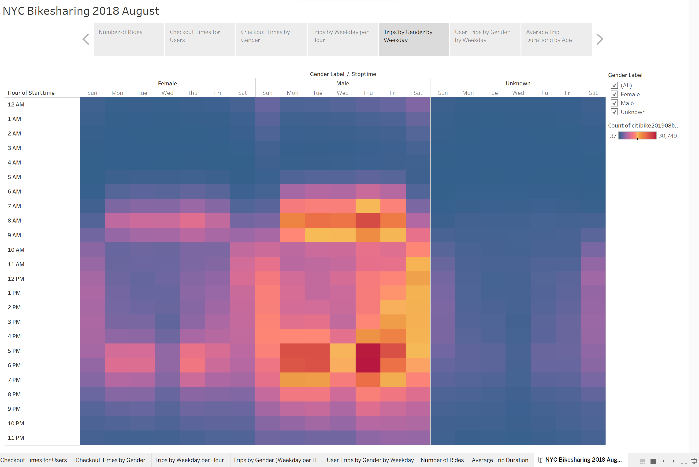

# Bikesharing

Module 14

Laurina LaStella

2022 September

https://public.tableau.com/app/profile/laurinalastella/viz/bikesharing_challenge_public/CheckoutTimesforUsers?publish=yes
---
---
---

# Overview of the analysis
## Using Tableau, create worksheets, dashboards, and stories to visualize key data. In a hypothetical scenario, convince investors that a bike-sharing program in Des Moines, IA is a solid business proposal.

---
---
---

# Results
#### *All data are from New York City in August 2018.*

## Tableau Story Point 1:
- ### Total number of rides.
---
---

## Tableau Story Point 2, Checkout Times for Users:
- ### The number of minutes of each ride. The vast majority of rides last less than one hour. The peak length of time for an average bike ride is 5 minutes.
---
---

## Tableau Story Point 3, Checkout Times by Gender:
- ### Gender has no noteworthy effect on amount of time spent riding.
---
---

## Tableau Story Point 4, Trips by Weekday per Hour:
- ### Thursday evening between 5pm and 7pm is the peak time for riding.
---
---

## Tableau Story Point 5, Trips by Gender by weekday:
- ### Gender has no noteworthy effect on time of day, or day of week spent riding.
---
---

## Tableau Story Point 6, User Trips by Gender by Weekday:
- ### Males who are subscribers, as opposed to occasional customers, are the overwhelming majority of riders.
---
---

## Tableau Story Point 7, Average Trip Duration by Age:
- ### Younger riders, in their teens and twenties, take longer rides than older riders.

---
---
---

# Summary

## Summary: Male subscribers use the bikes the most.
- Additional visualization suggestion: Distances of bike rides, based on Longitudes and Latitudes of starting and ending points. Useful measures would be the average distance of rides, a set of the shortest rides, and a set of the longest rides.
- Additional visualization suggestion: What relationship gender or age has to distance traveled.

